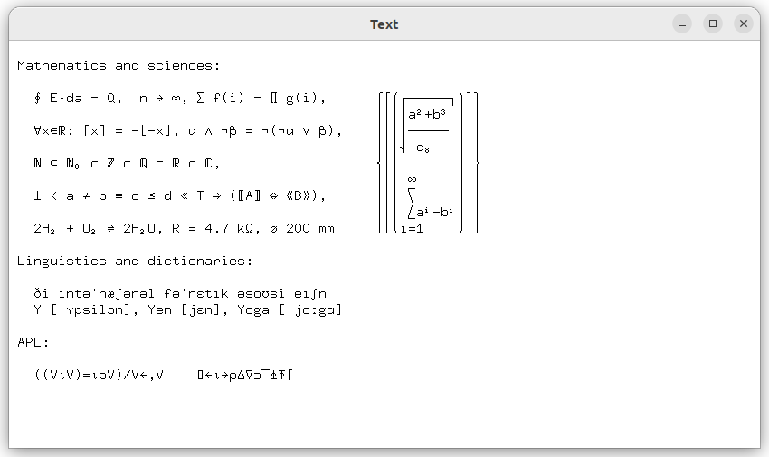

# hbsdl - Simple DirectMedia Layer for Harbour

`hbsdl` is a set of language bindings for Harbour, based on the SDL (Simple DirectMedia Layer) library 2.30.8. The goal of the project is to simplify the development
of multimedia applications, games, and interactive programs in the Harbour environment.

The `hbsdl` bindings are not a direct 1:1 mapping of SDL functions but are designed to make writing code easier, allowing developers to quickly and efficiently
use SDL in their projects. The solutions offered by `hbsdl` are user-friendly, aiming to minimize the need for handling the complex technical aspects of SDL,
while providing a more intuitive API.

The project is in active development, and its functionality is constantly expanding to meet the needs of application developers in Harbour.

### Example

Sample Text [sdl_drawFont.prg](tests/sdl_drawFont.prg)

